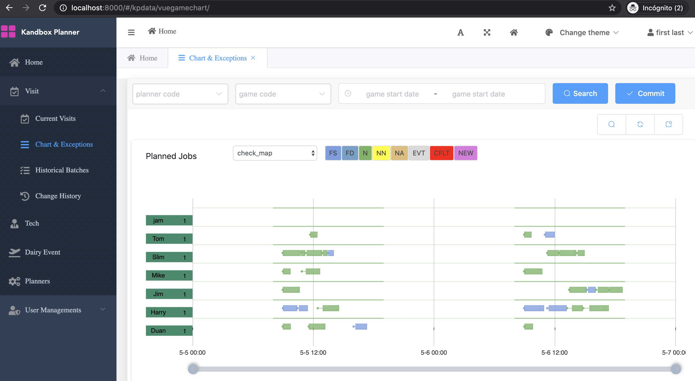

<p align="center">
<h2>Reinforcement Learning for Real Time Field Service Planning</h2>



</p>

---
<p align="center">
<a href="./README.md">中文</a> | English
</p>


## Online Demo
> This is a demo system to dispatch services in London area:

+ Address：[https://planner.kandbox.com](https://planner.kandbox.com)
+ user_email: demo@kandbox.com
+ password: Demo1234


Features
-----
👍 Timeline Chart with travel time

:point_right: Reinforcement Learning Environment per standard of Gym

:point_right: Heurisitc Agent for the Environment 

Get Started
-----
It is recommended to use docker version. For more details about installation, click [get_started_locallys](./doc/get_started_locally.md).

1. Prepare linux or macos with docker, docker-compose. This is how to install [docker-compose](https://docs.docker.com/compose/install/)
2. Run this commond in {KPlanner_HOME}/src folder:
    ```shell
    cd src
    docker-compose -f prod.yml build
    docker-compose -f prod.yml up
    ```
3. If there is no error, you should be able to create a super user with:

    ```shell
    cd src
    docker-compose -f prod.yml  run backend python manage.py createsuperuser
    ```

4. Open a browser and visit http://localhost:8000. You can create the rest of users with the super user credential.

5. (optional) To populate sample data, run :

    ```shell
    docker-compose -f prod.yml  run backend python kandbox_planner/fsm_adapter/toy_generator/london_service_generator.py 	<your_access_token>
    ```

# Keywords

Reinforcement Learning, Field Service Scheduling, Dispatching, Planning, AI, Optimization

Architecture
-----


# Technology Stack
Frontend UI: [Django](https://www.djangoproject.com/) | [Django-SimpleUI](https://github.com/newpanjing/simpleui/blob/master/doc/en/README_en.md)

Backend Algorithm Platform: [Gym](https://github.com/openai/gym) | [RLLib  for RL](https://docs.ray.io/en/latest/rllib.html) | [Ortools  for Optimization](https://github.com/google/or-tools)

Everything is in python but JS in browser.


# TODO
- Improve London area dispatching quality
- Create usage documents


# Known Issues
